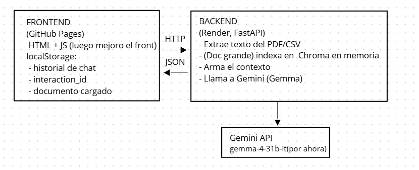
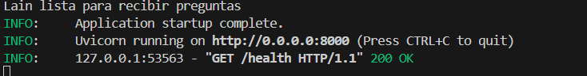
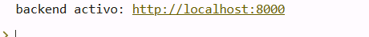
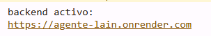
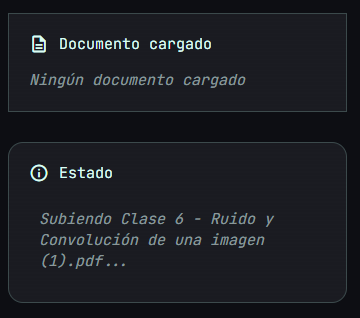
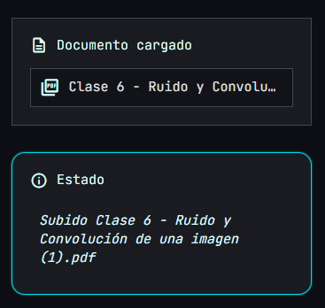
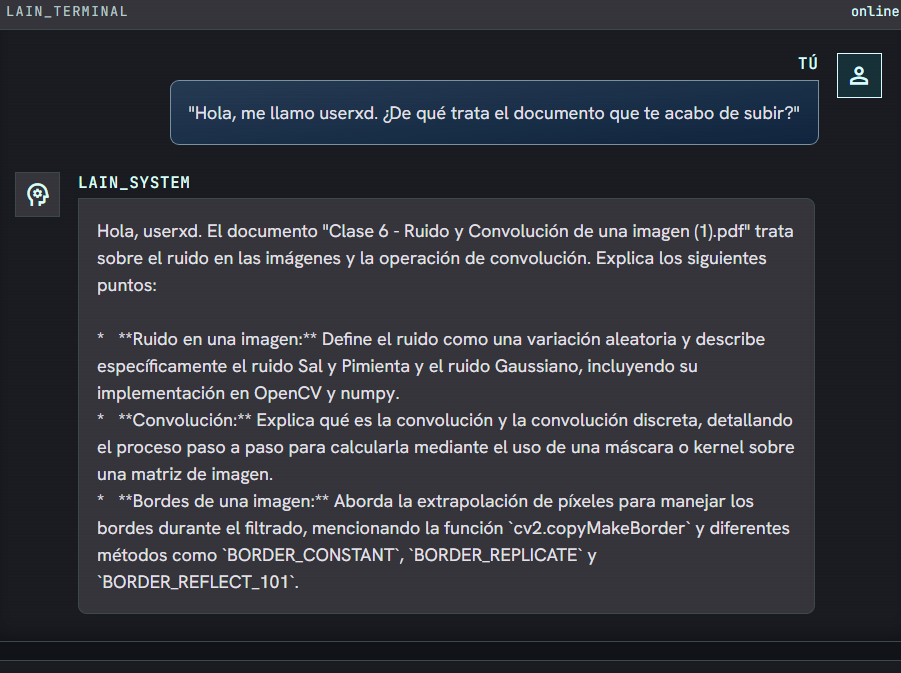
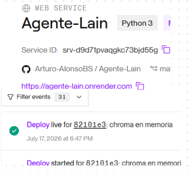

#  Pregúntale a Lain

Este proyecto es un Agente de Inteligencia Artificial desarrollado para el Challenge Final de Oracle Next Education (ONE) y Alura. Permite cargar documentos PDF o CSV y realizar preguntas en lenguaje natural sobre su contenido.

**Enlaces del Proyecto:**
*   **Frontend (Producción):** [https://arturo-alonsobs.github.io/Agente-Lain/](https://arturo-alonsobs.github.io/Agente-Lain/)
*   **Backend (API en Render):** [https://agente-lain.onrender.com](https://agente-lain.onrender.com)

---

<table>
  <tr>
    <td></td>
    <td><h2>Arquitectura de la Solución</h2></td>
  </tr>
</table>

El agente utiliza una arquitectura RAG (Retrieval-Augmented Generation) para evitar alucinaciones y responder solo con información del documento.

##  Arquitectura del Sistema

<p align="center">
  
</p>

---

<table>
  <tr>
    <td></td>
    <td><h2>Tecnologías Utilizadas</h2></td>
  </tr>
</table>

| Componente | Tecnología |
| :--- | :--- |
| **Lenguaje** | Python 3.12 |
| **Framework API** | FastAPI |
| **IA Modelo** | Google Gemini API |
| **Base de Datos** | ChromaDB |
| **Librerías** | pdfplumber, LangChain, Scikit-learn |
| **Frontend** | HTML, JavaScript Vanilla, Tailwind CSS |

---

##  Estructura del repositorio

```text
lain-agent/
├── .github/workflows/
│   └── static.yml          # Despliegue automático a GitHub Pages
├── backend/
│   ├── data/               # Documentos procesados
│   ├── config.py           # Gestión de API Keys y entorno
│   ├── gemini_client.py    # Integración con Google AI
│   ├── loader.py           # Lógica de RAG e indexación
│   ├── main.py             # Servidor API FastAPI
│   └── requirements.txt    # Dependencias de Python
├── frontend/
│   ├── assets/             # Imágenes de Lain y capturas
│   └── index.html          # Interfaz de usuario
└── README.md
```

## Instalación y Ejecución Local

```powershell
# 1. Clonar y acceder al directorio
cd /ruta/a/tu/lain-agent

# 2. Instalar Python 3.12 (si no se tiene)
winget install --id Python.Python.3.12 -e

# 3. Crear entorno virtual en la carpeta backend
py -3.12 -m venv backend/.venv

# 4. Activar el entorno
& backend/.venv/Scripts/Activate.ps1

# 5. Instalar dependencias
python -m pip install --upgrade pip
pip install -r backend/requirements.txt

# 6. Configurar API Key (Crear archivo .env en /backend)
Set-Content -Path backend/.env -Value "GEMINI_API_KEY=tu_api_key_aqui"

# 7. Ejecutar Servidor Backend
cd backend
uvicorn main:app --reload --host 0.0.0.0 --port 8000
```

**Nota sobre URLs de Backend:**
* **Local:** El sistema apuntará a `http://localhost:8000`. Verás la confirmación en consola:
<br>
* **Producción:** La web oficial se conecta a `https://agente-lain.onrender.com`.
<table>
  <tr>
    <td align="center"><b>Local</b><br>Si corres el backend en tu PC, verás:<br><code>backend activo: http://localhost:8000</code></td>
    <td align="center"><b>Producción (GitHub Pages)</b><br>Al usar la web publicada, verás:<br><code>backend activo: https://agente-lain.onrender.com</code></td>
  </tr>
  <tr>
    <td></td>
    <td></td>
  </tr>
</table>

## Pruebas de Funcionamiento

<table>
<tr>
<td><b>1. Carga de Documento</b><br>El sistema notifica el estado de la subida en tiempo real.</td>
<td><b>2. Procesamiento Exitoso</b><br>Una vez indexado, Lain confirma que está lista.</td>
</tr>
<tr>
<td></td>
<td></td>
</tr>
</table>

**Ejemplo de consulta RAG:**
A continuación se muestra a Lain respondiendo sobre un documento de procesamiento de imágenes:

<p align="center">

</p>

## Evidencia de Despliegue en la Nube

El backend está alojado en Render y el frontend en GitHub Pages. El deploy automático está configurado mediante CI/CD.

<p align="center">

</p>

---

## A tener en cuenta...

**Si la app muestra "offline" al abrir**, probá desactivar temporalmente bloqueadores de anuncios/privacidad (uBlock, Brave Shields, etc.) o probar en otro navegador/perfil. Algunas extensiones bloquean las peticiones de verificación de estado (`/health`) hacia el backend.

**El backend corre en el plan gratuito de Render**, que "duerme" tras un rato sin uso. Al abrir el frontend, este intenta despertarlo automáticamente, pero Render puede tardar más de 30 segundos en levantar cuando estaba dormido — más de lo que el frontend espera en el primer intento.

Si ves "offline" o errores de conexión en la consola al entrar:

1. Esperá unos 30-45 segundos (el backend ya se está levantando en segundo plano).
2. Recargá la página (F5). Debería mostrar "online" en ese segundo intento.

---
### Video Demostrativo
[Ver Demo en YouTube](https://youtu.be/8fYgY3Vy06o)

### Autor
**Arturo Alonso**
*Proyecto para Oracle Next Education (ONE).*